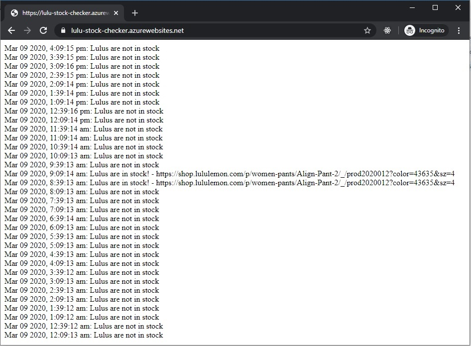

# Lulu Stock Checker



My girlfriend was trying to get a pair of Lululemon leggings in a certain size and color, but they were sold out everywhere. I built her this program that would check their site every 30 minutes and send an email when they're in stock.

## Installation
Clone the repo and install the dependencies
```
git clone https://github.com/omgitsfrancis/lulu-stock-checker
cd lulu-stock-checker
npm install
```

## Setup
At the projects root, create an environment variable file (.env). You'll need a gmail account for sending emails (preferably a throw-away account). Enter the details in the .env file.
```
EMAIL = "your_spam@gmail.com"
EMAIL_PASSWORD = "very_secure"
```

[More info on gmail setup](https://nodemailer.com/usage/using-gmail/)

Open the server.js file and edit the following constants:
```
const URL = "{URL for the lululemon product}";
const RECIPIENTS = [{List of emails to be notified}];
```
The URL needs to include the size and color.
Example:
https://shop.lululemon.com/p/women-pants/Align-Pant-2/_/prod2020012?color=41201&sz=6

## Execution
### Local execution (Test) - checks Lululemon every 5 seconds
```
npm run start
```

### Production - checks Lululemon every 30 mins
Make sure to set the .env variable on whatever cloud provider you decide to use. To execute:
```
npm run start:prod
```

## Usage
Visit servers root address (Ex. http://localhost:3000/) to see log.

Visit '/check' (Ex. http://localhost:3000/check) to manually execute stock checker.